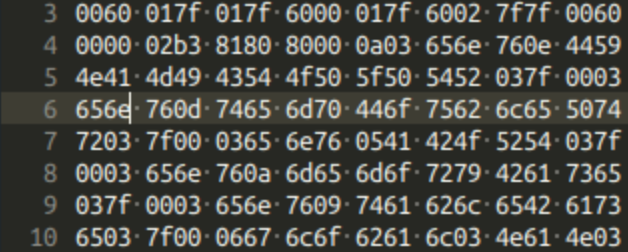

# Game Of Life

Prerequisites :
CMake: `brew install cmake`
XCode

Precompiled toolchain to compile C/C++ into WebAssembly
```
$ git clone https://github.com/juj/emsdk.git
$ cd emsdk
$ ./emsdk install latest
$ ./emsdk activate latest
$ ./emsdk activate latest
```

To enter an Emscripten compiler environment:
```
$ source ./emsdk_env.sh --build=Release
```

Same as Hello World Example ^^^
---

Make counter.c file

```
int counter = 100;

int count() {  
    counter += 1;
    return counter;
}
```

We compile the file with 

```
$ emcc counter.c -s WASM=1 -s SIDE_MODULE=1 -o counter.wasm
```

You might not see any result depending on what editor you are using.

